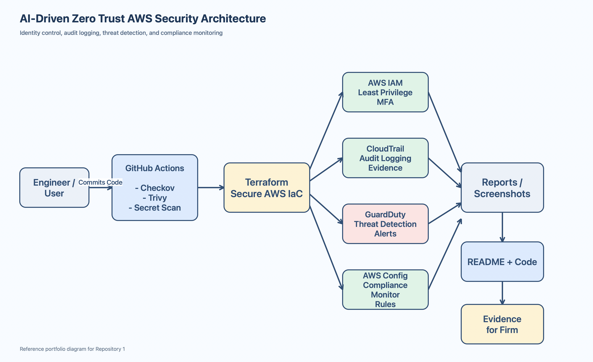

# AI-Driven Zero Trust Multi-Cloud Security Framework

## Overview

This project implements a Zero Trust cloud security framework across AWS, Azure, and Google Cloud Platform using identity-based access control, centralized audit logging, AI-driven threat detection, and automated compliance monitoring.

The AWS reference implementation in this repository emphasizes secure-by-default controls for auditability, least privilege, and compliance visibility using Terraform-managed security services.

## Problem This Solves

Traditional perimeter-based security fails in distributed multi-cloud environments. Misconfigured permissions, weak monitoring, and inconsistent control enforcement across platforms create exploitable gaps. This framework addresses those gaps by enforcing Zero Trust principles at the infrastructure level across all three platforms.

## Architecture Components

AWS:

- AWS IAM - Least privilege access control and MFA-enforced policies
- AWS CloudTrail - Centralized audit logging across all regions with log validation and CloudWatch integration
- AWS GuardDuty - AI-driven threat detection and suspicious activity alerts
- AWS Config - Continuous compliance monitoring and configuration rules
- KMS-backed encryption for log storage and monitoring services
- Terraform - Infrastructure-as-Code for repeatable secure deployments

Azure:

- Azure AD Conditional Access - MFA and compliant device enforcement
- Zero Trust identity policies across all applications and users

GCP:

- GCP IAM - Least privilege role bindings with time-bound conditions
- Organizational policies blocking insecure compute configurations

## Repository Structure

- `terraform/main.tf` - Core AWS provider, KMS, S3 logging buckets, encryption, and bucket policies
- `terraform/variables.tf` - Deployment variables for region and log bucket naming
- `terraform/iam.tf` - Least-privilege IAM policy example and password policy enforcement
- `terraform/logging.tf` - CloudTrail, CloudWatch logging integration, and audit event coverage
- `terraform/guardduty.tf` - GuardDuty detector and malware protection configuration
- `terraform/config.tf` - AWS Config recorder, delivery channel, and recording status
- `azure/main.tf` - Azure AD Conditional Access baseline for Zero Trust access controls
- `gcp/main.tf` - GCP IAM and organization policy controls
- `architecture/aws-zero-trust-architecture.png` - Reference architecture diagram for documentation and screenshots

## Key Security Controls

- KMS-backed encryption for S3 log buckets and CloudTrail-related logging resources
- Dedicated S3 access logging for the primary security log bucket
- TLS-only S3 bucket policies and public access blocking
- Multi-region CloudTrail with log file validation and API rate insights
- AWS Config recording with delivery channel support for compliance evidence
- GuardDuty malware protection for threat detection coverage

## Architecture

An example architecture diagram is included in this repository to visually demonstrate how identity control, logging, threat detection, and compliance monitoring integrate within the AWS environment.

## Standards Alignment

- NIST SP 800-207: Zero Trust Architecture
- NIST 800-53 Rev 5: AC-2, AC-3, AC-6, AU-2, AU-12, IA-2, IA-5, SC-7, SC-28, SI-4
- SOC 2: CC6.1, CC6.3, CC7.2
- ISO 27001: A.9, A.10, A.12

## Disclaimer

This is a reference implementation for research, educational, and portfolio demonstration purposes. It must be reviewed and adapted before use in any production environment.
